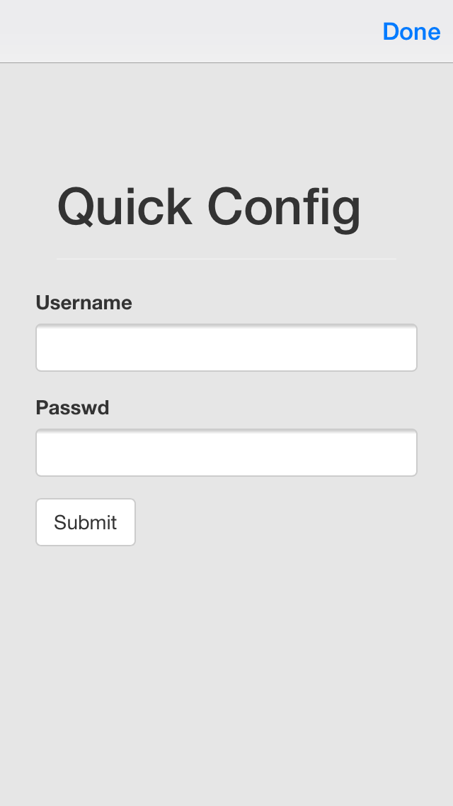

# Pebble Quick Configuration Website

[Pebble](https://developer.getpebble.com/)'s new [2.0 SDK](https://developer.getpebble.com/2/) supports convenient app configurations.  Setting up a configuration page currently requires setting up a web page with some light Javascript.  This page allows configuration pages to be easily templated with simple GET requests.

## Example
[Click here to see an example.](http://pebble-config.herokuapp.com/config?title=Quick%20Config&fields=email_Username,password_Pass)

    http://pebble-config.herokuapp.com/config?title=Quick%20Config&fields=email_Username,password_Pass

## Usage
To enable confuring of your application, you'll need to add some code to a few files (*these changes are already done in the included sample app*).

#### [appinfo.json](https://github.com/pyro2927/Pebble-Quick-Config/blob/master/quick-config-sample/appinfo.json)
You need to add the `configuration` string to the `capabilities` array in `appinfo.json`.

````
"capabilities": [
  "configurable"
]
````
For convenience, you'll also want to make note of the keys you'll be using in your config.

````
"appKeys": {
  "Username": 0,
  "Passwd": 1
}
````

#### [quick-config-sample.c](https://github.com/pyro2927/Pebble-Quick-Config/blob/master/quick-config-sample/src/quick-config-sample.c)
The name of your .C file may differ, depending on what you named your project.  You'll want to add an enum that matches the order of your `appKeys` from `appinfo.json`.

````
enum {
  CONFIG_USERNAME = 0x0,
  CONFIG_PASSWD = 0x1
};
````

*Note that the naming of the enum isn't important, just the order, though you may want to name them similarly as to not confuse things.*

Register to receive AppMessages from the JS side:

````
app_message_register_inbox_received(in_received_handler);
const uint32_t inbound_size = 64;
const uint32_t outbound_size = 64;
app_message_open(inbound_size, outbound_size);
````

and handle the incoming messages, making sure to pull out your config values:

````
void in_received_handler(DictionaryIterator *received, void *context) {
  // incoming message received
  Tuple *username_tuple = dict_find(received, CONFIG_USERNAME); //obtain a pointer to our config value
  if(username_tuple) {
    text_layer_set_text(text_layer, username_tuple->value->cstring); //display username
  } else {
    text_layer_set_text(text_layer, "Username not found");
  }
}
````

#### [pebble-js-app.js](https://github.com/pyro2927/Pebble-Quick-Config/blob/master/quick-config-sample/src/js/pebble-js-app.js)
Now you just need to configure PebbleJS to load up your configuration window and pass back the JSON-ified values:

````
Pebble.addEventListener("showConfiguration",
  function(e) {
    Pebble.openURL("http://pebble-config.herokuapp.com/config?title=Quick%20Config&fields=email_Username,password_Passwd"); // our dyanmic configuration page
  }
);
Pebble.addEventListener("webviewclosed",
  function(e) {
    var configuration = JSON.parse(e.response);
    Pebble.sendAppMessage(configuration);
  }
);
````

## Sample App
The [`quick-config-sample`](https://github.com/pyro2927/Pebble-Quick-Config/tree/master/quick-config-sample) directory hosts an 2.0 SDK [PebbleJS](http://developer.getpebble.com/2/guides/javascript-guide.html) app that uses [AppMessage](http://developer.getpebble.com/2/api-reference/group___app_message.html) to pass configuration values back to PebbleOS.  After the configuration screen is saved, it will present the username in the middle of the Pebble screen.

## Hosting
Currently this is hosted at <http://pebble-config.herokuapp.com/config>, but you can clone it and place it anywhere you like!

## Query Params
Currently there are only two query params:

1. title: a URL encoded title to be displayed at the top of the screen
2. fields: a comma seperated list of fields to display. If the string contains an underscore (*_*), the text preceeding the underscore will be used as the input field type. This is useful for things like *email* or *password*.

Make sure they are URL encoded and appended to <http://pebble-config.herokuapp.com/config?>


## Screenshot


## Thanks
Thanks to:

* webBoxio for [sinatra-heroku-boilerplate](https://github.com/webBoxio/sinatra-heroku-boilerplate)
* Twitter for [Twitter Bootstrap](http://getbootstrap.com/)
